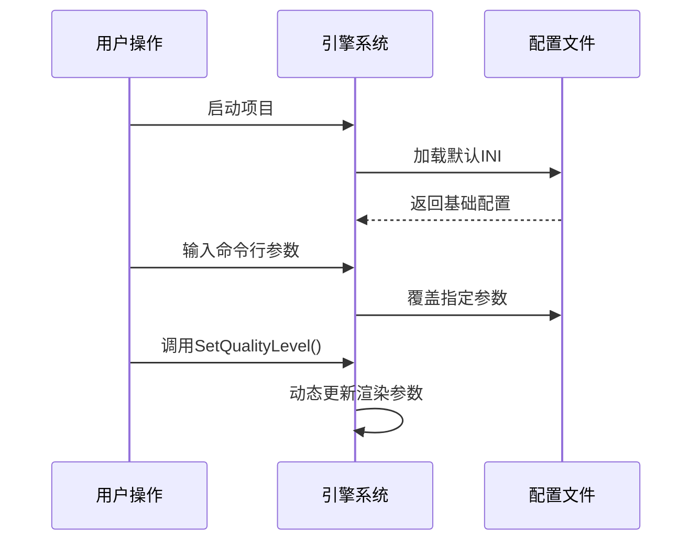
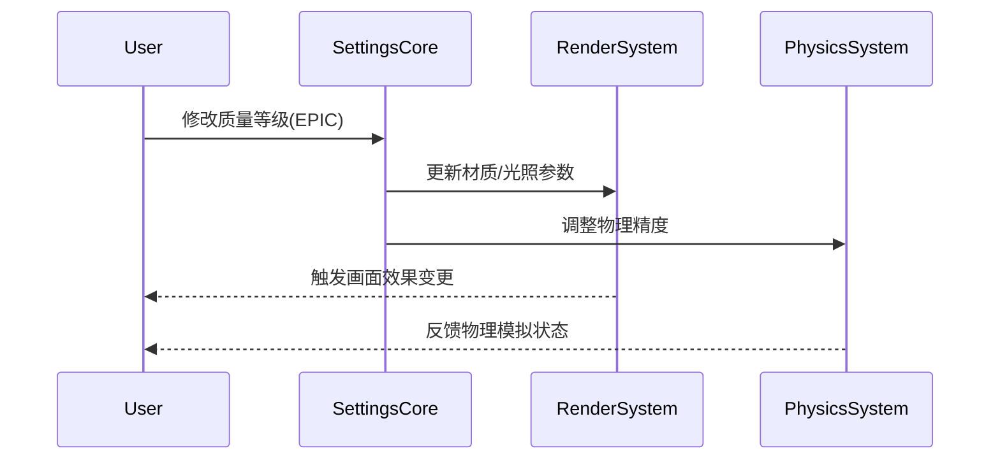
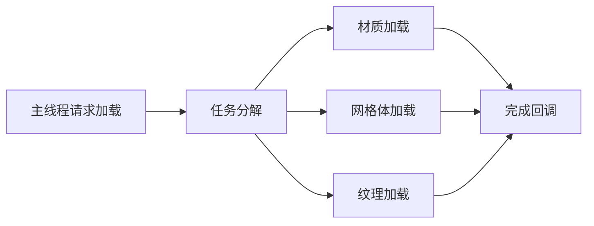

# CARLAUnreal 插件 Settings 模块技术文档

## 模块概述
Settings 模块是 CARLA 虚幻引擎插件的核心配置管理系统，负责处理服务器通信、画质设置、物理模拟等全局参数配置。支持多级配置覆盖机制（INI文件 > 命令行参数 > 运行时API），包含以下核心功能：

- **服务器端口管理**：RPC/流媒体/辅助端口联动配置
- **画质动态切换**：支持 Low/Epic 双模式一键切换
- **物理参数控制**：子步长模拟、确定性物理开关
- **多配置源支持**：内置配置文件加载、命令行覆盖、运行时API修改

---

## 核心配置文件
### CarlaSettings.ini
```ini
[CARLA/Server]
WorldPort=2000      ; RPC通信端口
StreamingPort=2001  ; 流媒体数据端口
SecondaryPort=2002  ; 辅助服务端口
SynchronousMode=false ; 同步模式开关
DisableRendering=false ; 渲染禁用开关

[CARLA/QualitySettings]
QualityLevel=Epic   ; 画质等级配置
```

---
## 配置加载流程图


---
## 主要配置参数

### 服务器参数
| 参数名             | 类型    | 默认值 | 说明                                                                 |
|--------------------|---------|--------|--------------------------------------------------------------------|
| RPCPort            | uint32  | 2000   | RPC 服务监听端口，控制客户端-服务器通信                             |
| StreamingPort      | uint32  | 2001   | 传感器数据流媒体端口（自动计算为 RPCPort+1）                        |
| SecondaryPort      | uint32  | 2002   | 辅助服务端口（自动计算为 RPCPort+2）                                |
| bSynchronousMode   | bool    | false  | 同步模式使能，需客户端同步控制帧更新                                |
| bDisableRendering  | bool    | false  | 禁用渲染模式（无画面输出，性能提升30%+）                            |

### 画质等级参数
#### 质量等级枚举
```cpp
enum EQualityLevel {
    Low,     // 低画质模式（性能优先）
    Epic,    // 史诗画质模式（画质优先）
    INVALID  // 无效值
};
```

#### 模式参数对照表
| 参数名称                        | Low 模式默认值 | Epic 模式默认值 | 说明                             |
|--------------------------------|---------------|----------------|----------------------------------|
| LightFadeDistance             | 1000.0        | -              | 光照淡出距离（单位：厘米）        |
| StaticMeshMaxDrawDistance     | 10000.0       | 无限制          | 静态网格最大绘制距离              |
| RoadPieceMeshMaxDrawDistance  | 15000.0       | 无限制          | 道路网格最大绘制距离              |
| PostProcessEffects            | 禁用          | 启用            | 后处理效果（运动模糊/环境光遮蔽） |
| ShadowCasting                 | 禁用          | 启用            | 动态阴影投射功能                  |

### 物理模拟参数
```cpp
struct FEpisodeSettings {
    bool bSubstepping = true;          // 子步长物理模拟（默认开启）
    double MaxSubstepDeltaTime = 0.01; // 最大子步长时间（秒）
    int MaxSubsteps = 10;              // 每帧最大子步数
    bool bDeterministicRagdolls = true;// 确定性布娃娃物理
};
```

---

## 命令行参数
| 参数格式                      | 示例                   | 说明                      |
|-----------------------------|------------------------|-------------------------|
| -carla-settings=FilePath    | -carla-settings=MyConfig.ini | 指定自定义配置文件路径    |
| -world-port=Value           | -world-port=3000       | 覆盖 RPC 端口            |
| -carla-streaming-port=Value | -carla-streaming-port=3001 | 指定流媒体端口          |
| -quality-level=Level        | -quality-level=Low     | 设置启动画质等级          |
| -no-rendering               | -                      | 禁用渲染模式              |
| -ros2                       | -                      | 启用 ROS2 接口支持        |

---
## 组件交互流程 


## 性能优化方案

### 异步加载策略

### 内存管理策略
| 资源类型 | 缓存策略 | 卸载条件 |  
  |------|------|------|  
  | 基础材质 | 永久缓存 | 进程退出|  
  | 场景专属材质 | LRU(最近最少使用)| 30秒未使用 |  
  | 高清纹理 | 	按需加载 | 质量等级切换时 | 

---
## 代码架构

### 核心类说明
#### UCarlaSettings (CarlaSettings.h)
- **功能**：全局配置容器
- **关键方法**：
  ```cpp
  void LoadSettings();  // 加载配置（INI + 命令行）
  void SetQualityLevel(EQualityLevel); // 动态设置画质等级
  void LogSettings() const; // 输出当前配置到日志
  ```

#### UCarlaSettingsDelegate (CarlaSettingsDelegate.h)
- **功能**：配置应用执行器
- **关键方法**：
  ```cpp
  void ApplyQualityLevelPostRestart(); // 应用画质设置到场景元素
  void ApplyQualityLevelPreRestart();  // 预处理渲染参数
  ```

#### FEpisodeSettings (EpisodeSettings.h)
- **功能**：运行时场景参数容器
- **动态调整示例**：
  ```cpp
  settings.bSynchronousMode = true;  // 启用同步模式
  settings.MaxSubsteps = 20;         // 修改物理子步数
  ```

---

## 画质等级实现细节

### Low 模式优化策略
1. **光照优化**：
   - 方向光源阴影禁用
   - 非方向光源自动隐藏
   - 光照函数淡出距离：1000单位

2. **渲染优化**：
   ```cpp
   // 典型渲染指令集
   r.DefaultFeature.MotionBlur 0    // 关闭运动模糊
   r.SSR.Quality 0                  // 禁用屏幕空间反射
   sg.ShadowQuality 0               // 关闭动态阴影
   ```

3. **材质系统**：
   - 使用 LowRoadMaterials 材质数组
   - 道路材质 LOD 距离：15000单位
   - 静态网格最大绘制距离：10000单位

### Epic 模式特性
```cpp
// 高端渲染配置
r.BloomQuality 5         // 全效果泛光
r.SSR.Quality 3          // 高质量屏幕空间反射
sg.TextureQuality 3      // 最高纹理质量
```

---
## 扩展开发指南

### Epic 模式特性
- 在CarlaSettings.ini定义配置项
- 在UCarlaSettings中添加UPROPERTY
- 实现配置加载逻辑
- 添加输入校验委托
- 暴露蓝图/C++接口


---
## 调试与日志
启用配置日志输出：
```cpp
// 在代码中调用
UCarlaSettings->LogSettings();

// 输出示例：
// [CARLA/Server] RPC Port = 2000
// [CARLA/QualitySettings] Quality Level = Epic
```

日志等级控制：
```ini
; 在 Engine.ini 中添加
[Core.Log]
LogCarla=Verbose
```

---

## 注意事项
1. **端口冲突规则**：
   - StreamingPort 必须为 RPCPort+1
   - SecondaryPort 必须为 RPCPort+2
   - 端口冲突时将自动递增寻找可用端口

2. **画质切换限制**：
   - 材质替换需重启场景生效
   - 后处理效果切换实时生效

3. **性能建议**：
   - Low 模式建议用于 >60FPS 场景
   - Epic 模式需要至少 6GB 显存

---

## 示例配置
### 命令行启动参数
```bash
CarlaUE4.exe -windowed -ResX=1280 -ResY=720 
  -carla-settings=Custom.ini 
  -quality-level=Low 
  -no-rendering
```

---

## 附录
### 依赖项
- **Unreal Engine 4.26+**：基础渲染管线
- **CARLA 0.9.13+**：道路坐标转换系统

### 已知问题处理
| 现象                  | 原因                | 解决方案                          |
|-----------------------|---------------------|-----------------------------------|
| 材质显示为粉色        | 材质路径错误        | 检查 LowRoadMaterials 配置项      |
| 物理模拟卡顿          | 子步数不足          | 增大 MaxSubsteps 至 15+           |
| 光照闪烁              | 淡出距离过小        | 调整 LowLightFadeDistance ≥2000   |

### 性能基准测试
| 场景                        | Low模式 FPS | Epic模式 FPS | 内存占用差异                            |
|--------------------------------|---------------|----------------|----------------------------------|
| 空场景             | 240        | 180              | +15%        |
| 复杂交通     | 85       | 45          | +32%              |


---
